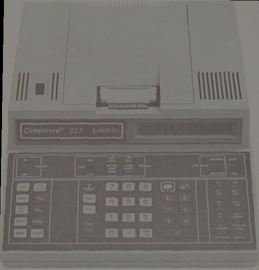

# ca327
Compucorp Alpha 327 emulator

_To the author's knowledge, this is the first publicly available emulator for the Compucorp Alpha 327._

## history

This is an emulator I wrote around 2003 to replace a failing Compucorp Alpha 327 used to execute
legacy calculator programs. It does not include the original application programs.

Found on an old backup HDD, ublished for archival purposes only.

## device

## opcodes

_ChatGPT made this advanced OCR from the opcodes page of the manual_

> After **ST**, **RCL**, **EXCH**, and **WRITE DATA** instructions (codes `300–340`),
> operand `0nn` specifies **direct** register access while `1nn` specifies **indirect** register access.

### Basic Operations

| Code | Operation | Code | Operation | Code | Operation | Code | Operation | Code | Operation |
|----:|-----------|----:|-----------|----:|-----------|----:|-----------|----:|-----------|
|000|0|024|÷|063|1/x|170|ARC SIN|300|ST|
|001|1|025|aˣ|070|SIN|171|ARC COS|301|ST +|
|002|2|026|(|071|COS|172|ARC TAN|302|ST -|
|003|3|027|)|072|TAN|173|TO POLAR|303|ST ×|
|004|4|030|RETURN|073|TO RECT|174|RAD →|304|ST ÷|
|005|5|032|IDENT|074|→ RAD|200|LABEL|305|ST aˣ|
|006|6|033|START/STOP|100|Function 0|217|0 → )|310|RCL|
|007|7|034|PRINT|114|PAUSE|220|SET D.P.|311|RCL +|
|010|8|035|PAPER ADV|115|D/M/S|234|0 → EXP|312|RCL -|
|011|9|036|RESET|137|CLEAR ALL REGS|240|→ METRIC|313|RCL ×|
|012|●|037|CLEAR|140|PREBLOCK|253|0 → CHG SIGN|314|RCL ÷|
|013|CHG SIGN|040|WRITE PROG|150|Σ DELETE|260|METRIC →|315|RCL aˣ|
|014|EXP|041|READ TAPE|151|MEAN|273|0 → CHG SIGN|320|EXCH|
|015|D/M/S|050|Σn,x,x²|160|eˣ|340|WRITE DATA|321|EXCH +|
|020|=|051|STD DEV|161|10ˣ|350|JUMP|322|EXCH -|
|021|+|060|LN|162|x²|351|JUMP +|323|EXCH ×|
|022|-|061|LOG|163|x!|352|JUMP -|324|EXCH ÷|
|023|×|062|√| | |353|JUMP ±|325|EXCH aˣ|

### Program Control

| Code | Instruction |
|----:|-------------|
|350|JUMP|
|351|JUMP +|
|352|JUMP -|
|353|JUMP ±|
|354|JUMP =|
|355|JUMP +=|
|356|JUMP -=|
|357|JUMP ±=|
|360|BRANCH|
|361|BRANCH +|
|362|BRANCH -|
|363|BRANCH ±|
|364|BRANCH =|
|365|BRANCH +=|
|366|BRANCH -=|
|367|BRANCH ±=|

---

### Built-in Functions (`100–137`)

These are selected by entering the function number after opcode **100**.

| Function No. | Description |
|-------------:|-------------|
|0|Clear Registers 1–3|
|1|Display *e*|
|2|Absolute Value|
|3|Mean|
|4|Standard Deviation|
|5|Fraction|
|6|Integer|
|7|Display π|
|8|Round Display|
|9|Identifier|
|.|Print Dot Line|
|CHG SIGN|Auto Test|
|EXP|Pause|
|CLEAR|Clear All Registers|

---

### Metric Conversion Table

Used with opcodes **240–253** (to metric) and **260–273** (from metric).

| Selector | To Metric | Code | From Metric | Code |
|:--:|------------------------|----:|------------------------|----:|
|0|°F → °C|240|°C → °F|260|
|1|Inch → cm|241|cm → Inch|261|
|2|Foot → Metre|242|Metre → Foot|262|
|3|Mile → Kilometre|243|Kilometre → Mile|263|
|4|in³ → cm³|244|cm³ → in³|264|
|5|US gal → Litre|245|Litre → US gal|265|
|6|UK gal → Litre|246|Litre → UK gal|266|
|7|Pound → Kilogram|247|Kilogram → Pound|267|
|8|Ounce → Gram|250|Gram → Ounce|270|
|9|lb/ft³ → g/cm³|251|g/cm³ → lb/ft³|271|
|.|lb/in² → kg/cm²|252|kg/cm² → lb/in²|272|
|CHG SIGN|Deg (Grad) → Rad|253|Rad → Deg (Grad)|273|
